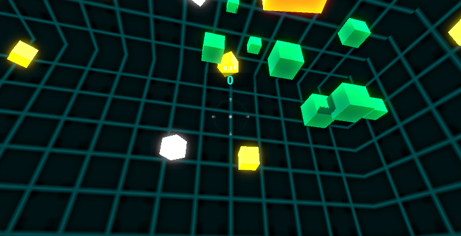
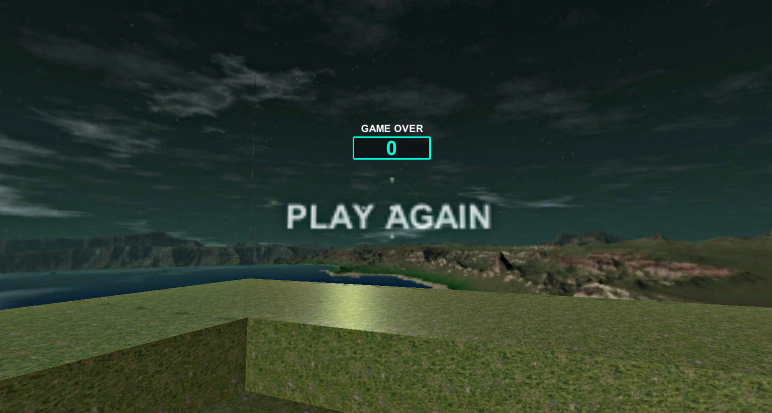
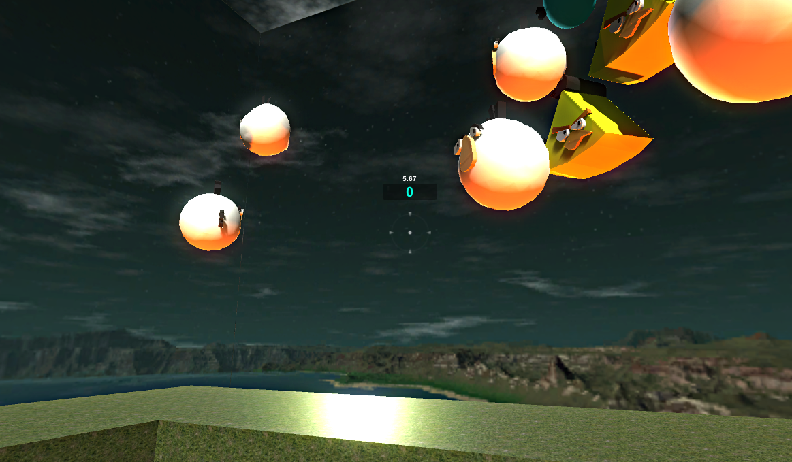

# Time-Attacks

## Overview

This project is a **Unity 3D first-person shooter (FPS) game** developed as part of a Coursera course. The project started as a guided training on creating a simple FPS game, and then expanded with additional features and levels to make it unique.

The game currently includes:
- First-person view, where the player controls a character to shoot targets.
- A dynamic scoring system, time bonuses, and penalties based on different target types.
- Two levels, each with distinct gameplay mechanics and enemy interactions.

The game is still in **development**, with plans for more features, improvements, and eventual release on game stores.

---

## Features

### Level 1
- **White Cube**: Adds extra time when shot.
- **Yellow Cube**: Deducts time when shot.
- **Green Cube**: Increases the player's score.
- **Level Progression**: Upon reaching a score threshold (e.g., 50 points), the player advances to the next level. A loading screen with shootable buttons transitions the player to the next level.

### Level 2 (New Feature Addition)
- **Angry Birds Characters**: Targets are replaced by "Angry Birds" characters, each with specific actions.
- **Red Angry Bird (Enemy)**: The player loses the game if the Red Angry Bird collides with them. The player must shoot the Red Angry Bird to survive.
- **Other Angry Birds**: Shooting other Angry Birds gives the player time and score boosts.
- **New Level Design**: A more challenging and engaging level that introduces new gameplay dynamics.

---

## Future Plans

The game is still in development, with plans to:
- Add more levels with unique challenges.
- Polish the user interface (UI) and improve user experience (UX).
- Integrate additional enemies and power-ups.
- Optimize for mobile and desktop platforms.
- Release the game to major stores like Steam, Google Play, and the Apple App Store.

---

## Getting Started

### Prerequisites

- Unity 2021 or later.
- Basic knowledge of Unity and C# for gameplay logic and level design.

## Screenshots

Here are some screenshots of the game:
### Level 1: Shooting Targets

### Loading Level Screenshot: 

### Level 2: Enemy Red Angry Bird

(Screenshots to be updated as development progresses)

## Contributing

Feel free to fork the project and add new ideas. Pull requests are welcome!

## License

This project is licensed under the MIT License - see the LICENSE file for details.

## Credits

- **Course Inspiration**: This project was started as part of a Coursera Introduction to Game Development course.
- **Additional Content**: Added new levels, enemy designs, and mechanics for a unique gameplay experience.

